# Healthcare Analytics Project

## The Story

A hospital management noticed a problem: **They didn't understand their patient patterns, had long wait times, and weren't sure where to allocate resources effectively.** As a data analyst, exploring the data to answer critical questions and help them make better decisions.

---

## The Questions We Answered

### 1. Who Are Our Patients?
**First, we need to understand demographics**

I segmented patients into three age groups:
- **Pediatric** (0-17 years)
- **Adult** (18-64 years)  
- **Senior** (65+ years)

Then analyzed gender distribution across each group.

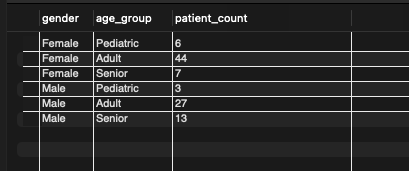

---

### 2. What Diseases Are Most Common?
**Next, we identified health patterns**

I found the top diagnoses overall and broke them down by:
- Age group (what diseases affect which ages?)
- Gender (any gender differences?)

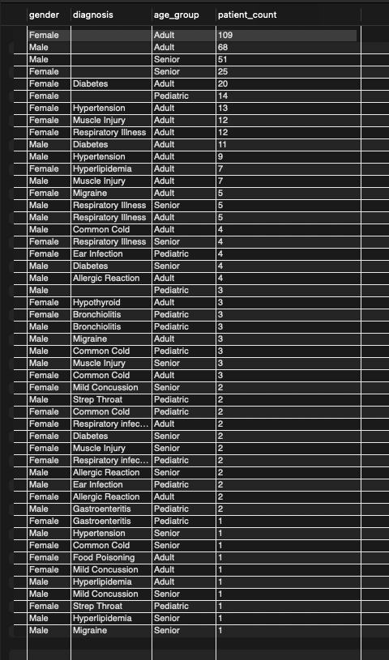
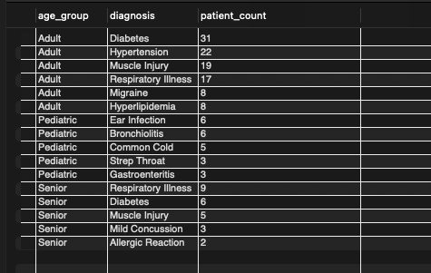

---

### 3. Why Are Patients Waiting So Long?
**Operational efficiency matters**

I analyzed appointment wait times:
- Average wait time **by department** (which departments are slowest?)
- Peak hours (when does congestion happen?)
- Patients waiting >30 minutes (how bad is it?)

**Key Finding:** Some departments average 15 mins, others 35+ mins

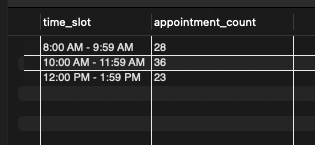
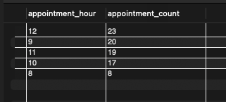

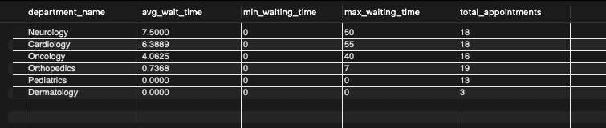

---

### 4. Are Diabetic Patients Well-Managed?
**Focus on chronic disease management**

For patients with diabetes, I checked:
- Blood sugar levels (normal: 70-100 mg/dL)
- Smoking impact
- Gender differences in outcomes
- Which medications work best

**Key Finding:** Certain medications showed better blood sugar control; some patients had abnormal levels needing intervention

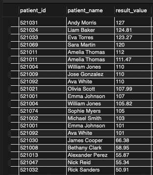
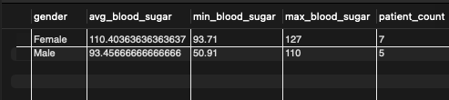
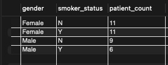
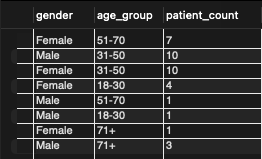
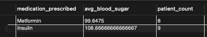

---

### 5. Who's At Risk for Heart Disease?
**Preventive care strategy**

I categorized patients into risk levels:
- **High Risk:** Smokers + (hypertension or diabetes)
- **Medium Risk:** Non-smokers + (hypertension or diabetes)
- **Low Risk:** Everyone else

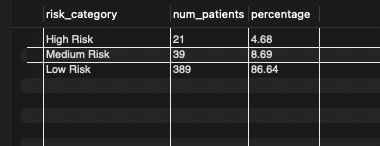

---

### 6. Why Do Patients Come Back?
**Understanding readmissions**

I identified patients readmitted within 30 days and found:
- Which departments have higher readmission rates
- Patient profiles (age, BMI) of readmitted patients

**Key Finding:** Readmission rates vary by department, some need better discharge planning

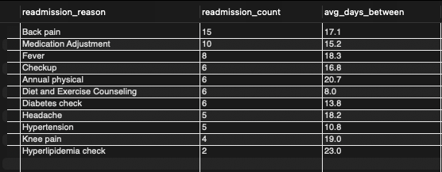
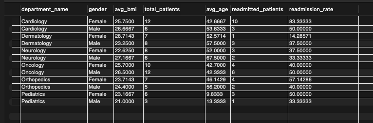

---

## How I Did It

**Tools Used:** SQL, Database Queries

**Key Techniques:**
- Multi-table JOINs to combine patient data with visits and lab results
- Window functions to rank diagnoses by group
- Time calculations (TIMESTAMPDIFF) to analyze appointment patterns
- Aggregations (COUNT, AVG, MIN, MAX) to summarize data
- CASE statements for age group categorization

---

## Key Recommendations

1. **Staffing:** Increase resources in departments with long wait times
2. **Scheduling:** Optimize during peak hours (9-11 AM, 2-3 PM)
3. **Diabetes Care:** Review medications; target patients with abnormal blood sugar
4. **Risk Program:** Launch preventive program for high-risk patients
5. **Quality:** Review discharge processes in high-readmission departments

---

## Project Files

- `Healthcare_Analysis.sql` - All SQL queries
- `README.md` - This guide

---

## Impact

- Data-driven resource allocation  
- Improved patient experience (reduced wait times)  
- Enhanced care quality (reduced readmissions)  
- Targeted preventive care programs  